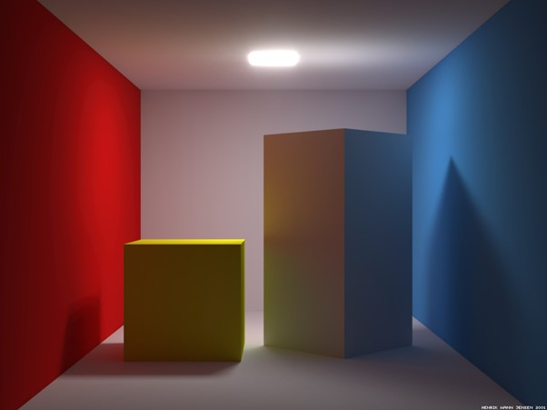

# Raytracer Aufgabe
Schreiben Sie einen Raytracer in Python. Erzeugen Sie damit ein Bild, auf dem zwei Boxen zu sehen sind, die auf einem Boden stehen und von zwei Wänden und einer Decke eingeschlossen sind. Die Linke Wand ist rot und die Rechte blau. Die Linke Box ist gelb und die Rechte weiß. An der Decke befindet sich eine quadratische Lichtquelle (vgl. Bild). Aus der Dokumentation sollte hervorgehen, auf welchen theoretischen Prinzipien das bildgebende Verfahren basiert, wie es algorithmisch umgesetzt wurde, und wie es implementiert wurde. Bewertet wird, welche Beleuchtungseffekte berücksichtigt werden können, wie sie umgesetzt werden, wie gut sie implementiert werden und wie gut dies dokumentiert wird. Als Orientierung für eine sehr gute Dokumentation dient auch hier [thebookofshaders.com](https://thebookofshaders.com/) **(100 Punkte)**

- Bild:

- Erlaubte Python Bibliotheken:
    - Matplotlib
    - Numpy
    - Scipy
    - abc
    - functools
    - pathlib
    - numbers
    - time
    - PIL

- Bewertung:
    - Dokumentation:
        - Theorie: 20P
        - Verknüpfung Theorie-Praxis (Algorithmik und deren Erläuterung): 20P
        - Dokumentation der Hauptfunktionsweisen des Codes: 20P
    - Umsetzung:
        - Beleuchtungseffekte: 20P
        - Ästhetik: 20P