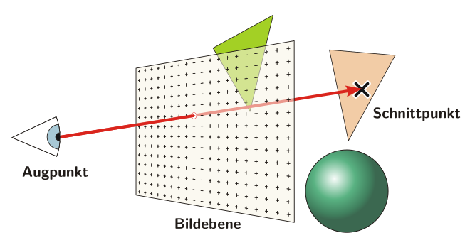
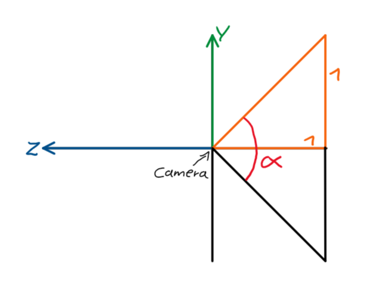

# Dokumentation Raytracer
## 1. Theorie
### 1.1 Funktionsweise
Zuerst soll die allgemeine Funktionsweise eines Raytracers erläutert werden.

**In der Realität** geschiet die Beleuchtung folgendermaßen:
Lichtstrahlen werden von einer Quelle (wie z.B. der Sonne) emittiert. Treffen sie auf ein diffuses Objekt werden sie von der Oberfläche in alle möglichen Richtungen emittiert. Dies geschiet da die Oberfläche der Objekte (auch wenn sie flach aussieht) mikroskopisch kleine Strukturen besitzt, welche die eintreffenden Lichtstrahlen in alle möglichen Richtungen reflektieren.

Außerdem treten noch andere Effekte wie z.B. Absorption gewisser Frequenzen (wodurch Objekte farbig erscheinen), oder durchsichtige und reflektierende Elemente auf. Abgesehen von der Absorption sind diese für dieses Projekt allerdings nicht relevant.

**In der Computergrafik** wäre eine exakte nachbildung des Vorgangs aber mit unnötig hohen Rechenkosten verbunden, da sehr viele Strahlen berechnet werden würden, welche am Ende gar nicht das Auge des Betrachters treffen. Stattdessen wird der reelle Vorgang sozusagen rückwärts abgespielt.

*Quelle: https://upload.wikimedia.org/wikipedia/commons/thumb/f/f1/Raytracing.svg/660px-Raytracing.svg.png*

Wie in dem Bild zu sehen wird also zuerst ein Strahl von dem Auge des Betrachters durch einen Punkt der Bildebene erzeugt ("Primary Ray") und es wird dann betrachtet, wie sich der Strahl verhält. Soll ein Bild mit einer vorgegeben Auflösung erzeugt werden, wird dieser Vorgang für alle Pixel durchgeführt, wobei der Strahl immer durch das Zentrum des Pixels geht.

Trifft so ein Strahl auf ein diffuses Objekt wird von dem Auftreffpunkt aus ein neuer Strahl in Richtung der Lichtquelle erzeugt. Trifft dieser Strahl auf die Lichtquelle, ist der Auftreffpunkt beleuchtet. Trifft er noch vor der Lichtquelle auf ein anderes Objekt, dass die Lichtquelle verdeckt ist der uhrsprüngliche Auftreffpunkt nicht beleuchtet, liegt also im Schatten.

Dieser Algortihmus ist zwar sehr simpel, jedoch müssen viele Berechnungen durchgeführt werden, wodurch der Algorithmus sehr Zeitaufwändig wird.

### 1.2 Mathematische Grundlagen
Außerdem sollen zunächst noch ein paar mathematische Grundlagen bereitgestellt werden, welche im Verlauf dieses Projektes von Relevanz sind.

*Hinweis: alle Vektoren haben die Form: $\vec{a} = \begin{bmatrix} x \\ y \\ z \end{bmatrix}$ (der einfacheren Lesbarkeit halber werden in der Dokumentation ggf. Zeilenvektoren verwendet) mit folgender Orientierung:*

#### 1.2.1 Vektoren
Da viel mit Vekroren gearbeitet wird, werden hierzu ein paar Grundlagen bereitgestellt.

- Länge: $||\vec{v}|| = \sqrt{x^2+y^2+z^2}$
- Normalisierter Vektor: $||\vec{v}_n|| = 1 \Rightarrow \vec{v}_n = \vec{v} / ||\vec{v}||$
- Skalarprodukt: $\vec{a} \cdot \vec{b} = x_a \cdot x_b + y_a \cdot y_b + z_a \cdot z_b$
- Winkel zwischen zwei Vektoren:
  - $\theta = \arccos(\vec{a}_n \cdot \vec{b}_n)$
- Kreuzprodukt:
  - $\vec{c} = \vec{a} \times \vec{b} = \begin{bmatrix} y_a \cdot z_b - z_a \cdot y_b \\ z_a \cdot x_b - x_a \cdot z_b \\ x_a \cdot y_b - y_a \cdot x_b \end{bmatrix}$
  - Es gilt: $\vec{c} \perp \vec{a},\ \vec{c} \perp \vec{b}$

**Geraden**
- Geraden im Raum bestehen immer aus einer Positions- und einer Richtungskomponente mit einem Parameter:
  - $G = \vec{o} + t \cdot \vec{d}$ 
  - $\vec{o}$: Offset (Position)
  - $\vec{d}$: Direction (Richtung)
  - $t$: Parameter
  - Somit lassen sich alle Punkte auf der Geraden beschreiben

#### 1.2.2 Rotationsmatrizen
Soll ein Vektor um eine Achse um den Winkel $\theta$ rotiert werden, können dafür Rotationsmatrizen eingesetzt werden. Die Matrix um einen Vektor um die y-Achse rotiert werden lautet die Matrix:

$R_z(\theta)= \begin{bmatrix} \cos(\theta) & \sin(\theta) & 0 \\ -\sin(\theta) & \cos(\theta) & 0 \\ 0 & 0 & 1 \\ \end{bmatrix}$

## 2. Anwendung der Theorie
In diesem Abschnitt soll beschrieben werden, wie die in der Theorie gestellten Anforderungen umgesetzt werden können, ohne dabei auf die genaue Implementierung in Python einzugehen.

### 2.1 Erzeugung der Primary Rays

#### 2.1.1 Konventionen
Der Einfachheit halber wurde die Definition getroffen, dass die Kamera immer an der Position $\begin{bmatrix} 0 & 0 & 0\end{bmatrix}$ liegt und in Richtung der negativen z-Achse schaut. Die Bildebene ist dabei exakt eine Einheit von der Kamera entfernt. Ihr Mittelpunkt befindet sich also an $\begin{bmatrix} 0 & 0 & -1 \end{bmatrix}$.

#### 2.1.2 Quadratisches Bild
*Da die Bildebene bei $z = -1$ liegt, müssen nur die y- und x-Koordinaten bestimmt werden.*

Soll für ein Pixel der Primary Ray erzeugt werden, wird das benötigte Pixel durch den Vektor $\begin{bmatrix} Pixel_x & Pixel_y\end{bmatrix}$ angegeben. Daraus müssen die Koordinaten für den "World Space" also das allgemein gültige Koordinatensystem generiert werden.

Dafür werden die Koordinaten zuerst in den "Screen Space" gebracht, dieser geht von $\begin{bmatrix} -1 & -1 \end{bmatrix}$ bis $\begin{bmatrix} 1 & 1\end{bmatrix}$ wobei $\begin{bmatrix} 0 & 0 \end{bmatrix}$ den Mittelpunkt der Bildebene darstellt. Die Formeln hierfür lauten:

$\begin{array}{l}
    PixelScreen_x = 2 \cdot \frac{Pixel_x + 0.5}{ImageWidth} - 1 \\
    PixelScreen_y = 1 - 2 \cdot \frac{Pixel_y + 0.5}{ImageHeight}
\end{array}$
- ImageWidth, ImageHeight: Bildmaße in Pixeln 
- *Die Verschiebung von $ + 0.5$ kommt daher, dass der Strahl durch das Zentrum des Pixels gehen soll.*

#### 2.1.3 Rechteckiges Bild
Aber die wenigsten Bildformate sind quadratisch, deswegen müssen auch rechteckige Formate berücksichtigt werden.

*Quelle: https://www.scratchapixel.com/images/upload/ray-tracing-camera/camratio.png?*

Wie das Bild zeigt, sind die Pixel nicht mehr Quadratisch, wenn gilt $ImageWidth \neq ImageHeight$. Dementsprechend muss das Seitenverhältnis ("Image Aspect Ratio") beachtet werden. Dies wird gelöst, indem die Spannweite der Bildebene auf der x-Achse angepasst wird. Damit werden die Koordinaten in den sogenannten "Camera Space" gebracht.

Damit ergeben sich folgende Formeln:

$\begin{array}{ll}
ImageAspectRatio = \frac{ImageWidth}{ImageHeight} \\
PixelCamera_x = (2 * PixelScreen_x - 1) * ImageAspectRatio \\
PixelCamera_y = (1-2*PixelScreen_y) \\
\end{array}$

#### 2.1.4 Field of View
Zusätzlich soll es noch die Möglichkeit geben, das Field of View einzustellen, d.h. wie groß der Winkel des sichtbaren Bereichs ist. Besser verständlich anhand des folgenden Bilds:

*Quelle: https://www.scratchapixel.com/images/upload/ray-tracing-camera/camprofile.png?*

Je größer hier $\alpha$ (also das Field of View) wird, desto mehr ist von der einzufangenen Szene sichtbar. Diese Einstellung funktioniert also ähnlich wie ein Zoom, mit dem näher an die Szene herangezoomt oder weiter hinausgezoomt werden kann.

Mit dieser Einstellung lauten die Formeln für die Camera Space Koordinaten wie folgt:
 $\begin{array}{ll}
PixelCamera_x = (2 * PixelScreen_x - 1) * ImageAspectRatio * \tan{\frac{\alpha}{2}} \\
PixelCamera_y = (1 - 2 * PixelScreen_y) * \tan{\frac{\alpha}{2}}
\end{array}$

#### 2.1.5 Übergang in den World Space:
Da die Kamera hier immer an der Position $\begin{bmatrix}0 & 0 & 0\end{bmatrix}$ liegt und in Richtung der negativen z-Achse zeigt, die Bildebene also parallel zur x-y-Ebene liegt, sind die x- und y-Koordinaten des Camera Space bereits in dem World Space.

Der finale Punkt im World Space lautet also:

$P = \begin{bmatrix} PixelCamera_x \\ PixelCamera_y \\ -1 \end{bmatrix}$

Der Primary Ray kann dann sehr einfach berechnet werden, indem $\begin{bmatrix} 0 & 0 & 0 \end{bmatrix}$ als Ortsvektor (Offset) und der berechnete Punkt $P$ als Richtungsvektor (direction) verwendet wird.
Es gilt also:
$Ray = t \cdot \vec{p} = t \cdot \begin{bmatrix} PixelCamera_x \\ PixelCamera_y \\ -1 \end{bmatrix}$

