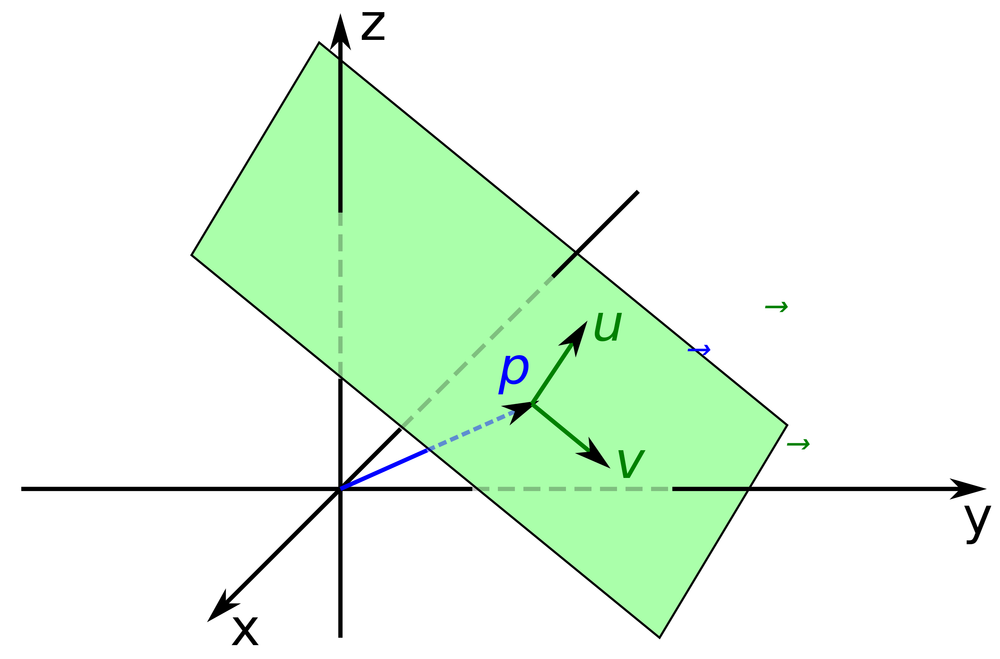
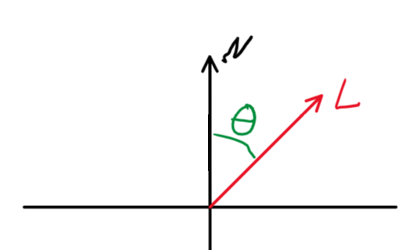

# Dokumentation Raytracer

## Inhaltsverzeichnis
- [Dokumentation Raytracer](#dokumentation-raytracer)
  - [Inhaltsverzeichnis](#inhaltsverzeichnis)
  - [1. Theorie](#1-theorie)
    - [1.1 Funktionsweise](#11-funktionsweise)
    - [1.2 Mathematische Grundlagen](#12-mathematische-grundlagen)
      - [1.2.1 Vektoren](#121-vektoren)
      - [1.2.2 Rotationsmatrizen](#122-rotationsmatrizen)
  - [2. Anwendung der Theorie](#2-anwendung-der-theorie)
    - [2.1 Erzeugung der Primary Rays](#21-erzeugung-der-primary-rays)
      - [2.1.1 Konventionen](#211-konventionen)
      - [2.1.2 Quadratisches Bild](#212-quadratisches-bild)
      - [2.1.3 Rechteckiges Bild](#213-rechteckiges-bild)
      - [2.1.4 Field of View](#214-field-of-view)
      - [2.1.5 Übergang in den World Space:](#215-übergang-in-den-world-space)
    - [2.2 Berechnen der Schnittpunkte von Rays mit Objekten](#22-berechnen-der-schnittpunkte-von-rays-mit-objekten)
      - [2.2.1 Kugeln](#221-kugeln)
      - [2.2.2 Ebene](#222-ebene)
      - [2.2.3 Quader](#223-quader)
    - [2.3 Korrektes Shading und Lichtquellen](#23-korrektes-shading-und-lichtquellen)
      - [2.3.1 Shading](#231-shading)
      - [2.3.2 Lichtquellen](#232-lichtquellen)
  - [3. Dokumentation des Codes](#3-dokumentation-des-codes)
    - [3.1 Generierung der Primary Rays](#31-generierung-der-primary-rays)
    - [3.2 Objekte](#32-objekte)
    - [3.3 Licht und Lichtquellen](#33-licht-und-lichtquellen)
    - [3.4 Ray-Tracing Algorithmus](#34-ray-tracing-algorithmus)
    - [3.5 Utils](#35-utils)
    - [3.6 Main-Funktion](#36-main-funktion)

## 1. Theorie
### 1.1 Funktionsweise
Zuerst soll die allgemeine Funktionsweise eines Raytracers erläutert werden.

**In der Realität** geschiet die Beleuchtung folgendermaßen:
Lichtstrahlen werden von einer Quelle (wie z.B. der Sonne) emittiert. Treffen sie auf ein diffuses Objekt werden sie von der Oberfläche in alle möglichen Richtungen emittiert. Dies geschiet da die Oberfläche der Objekte (auch wenn sie flach aussieht) mikroskopisch kleine Strukturen besitzt, welche die eintreffenden Lichtstrahlen in alle möglichen Richtungen reflektieren.

Außerdem treten noch andere Effekte wie z.B. Absorption gewisser Frequenzen (wodurch Objekte farbig erscheinen), oder durchsichtige und reflektierende Elemente auf. Abgesehen von der Absorption sind diese für dieses Projekt allerdings nicht relevant.

**In der Computergrafik** wäre eine exakte nachbildung des Vorgangs aber mit unnötig hohen Rechenkosten verbunden, da sehr viele Strahlen berechnet werden würden, welche am Ende gar nicht das Auge des Betrachters treffen. Stattdessen wird der reelle Vorgang sozusagen rückwärts abgespielt.

*Abb.1: Strahlenrichtung beim Ray-Tracing, Quelle: https://upload.wikimedia.org/wikipedia/commons/thumb/f/f1/Raytracing.svg/660px-Raytracing.svg.png*

Wie in dem Bild zu sehen wird also zuerst ein Strahl von dem Auge des Betrachters durch einen Punkt der Bildebene erzeugt ("Primary Ray") und es wird dann betrachtet, wie sich der Strahl verhält. Soll ein Bild mit einer vorgegeben Auflösung erzeugt werden, wird dieser Vorgang für alle Pixel durchgeführt, wobei der Strahl immer durch das Zentrum des Pixels geht.

Trifft so ein Strahl auf ein diffuses Objekt wird von dem Auftreffpunkt aus ein neuer Strahl in Richtung der Lichtquelle erzeugt. Trifft dieser Strahl auf die Lichtquelle, ist der Auftreffpunkt beleuchtet. Trifft er noch vor der Lichtquelle auf ein anderes Objekt, dass die Lichtquelle verdeckt ist der uhrsprüngliche Auftreffpunkt nicht beleuchtet, liegt also im Schatten.

Dieser Algortihmus ist zwar sehr simpel, jedoch müssen viele Berechnungen durchgeführt werden, wodurch der Algorithmus sehr Zeitaufwändig wird.

### 1.2 Mathematische Grundlagen
Außerdem sollen zunächst noch ein paar mathematische Grundlagen bereitgestellt werden, welche im Verlauf dieses Projektes von Relevanz sind.

*Hinweis: alle Vektoren haben die Form: $\vec{a} = \begin{bmatrix} x \\ y \\ z \end{bmatrix}$ (der einfacheren Lesbarkeit halber werden in der Dokumentation ggf. Zeilenvektoren verwendet) mit folgender Orientierung:*

*Abb. 2: Orientierung des verwendeten Koordinatensystems*

#### 1.2.1 Vektoren
Da viel mit Vekroren gearbeitet wird, werden hierzu ein paar Grundlagen bereitgestellt.

- Länge: $||\vec{v}|| = \sqrt{x^2+y^2+z^2}$
- Normalisierter Vektor: $||\vec{v}_n|| = 1 \Rightarrow \vec{v}_n = \vec{v} / ||\vec{v}||$
- Skalarprodukt: $\vec{a} \cdot \vec{b} = x_a \cdot x_b + y_a \cdot y_b + z_a \cdot z_b$
- Winkel zwischen zwei Vektoren:
  - $\theta = \arccos(\vec{a}_n \cdot \vec{b}_n)$
- Kreuzprodukt:
  - $\vec{c} = \vec{a} \times \vec{b} = \begin{bmatrix} y_a \cdot z_b - z_a \cdot y_b \\ z_a \cdot x_b - x_a \cdot z_b \\ x_a \cdot y_b - y_a \cdot x_b \end{bmatrix}$
  - Es gilt: $\vec{c} \perp \vec{a},\ \vec{c} \perp \vec{b}$

**Geraden**
- Geraden im Raum bestehen immer aus einer Positions- und einer Richtungskomponente mit einem Parameter:
  - $G = \vec{o} + t \cdot \vec{d}$ 
  - $\vec{o}$: Offset (Position)
  - $\vec{d}$: Direction (Richtung)
  - $t$: Parameter
  - Somit lassen sich alle Punkte auf der Geraden beschreiben

#### 1.2.2 Rotationsmatrizen
Soll ein Vektor um eine Achse um den Winkel $\theta$ rotiert werden, können dafür Rotationsmatrizen eingesetzt werden. Die Matrix um einen Vektor um die y-Achse rotiert werden lautet die Matrix:

$R_y(\theta)= \begin{bmatrix} \cos(\theta) & 0 & -\sin(\theta) \\ 0 & 1 &  0 \\ \sin(\theta) & 0 & \cos(\theta) \\ \end{bmatrix}$

## 2. Anwendung der Theorie
In diesem Abschnitt soll beschrieben werden, wie die in der Theorie gestellten Anforderungen umgesetzt werden können, ohne dabei auf die genaue Implementierung in Python einzugehen.

### 2.1 Erzeugung der Primary Rays

#### 2.1.1 Konventionen
Der Einfachheit halber wurde die Definition getroffen, dass die Kamera immer an der Position $\begin{bmatrix} 0 & 0 & 0\end{bmatrix}$ liegt und in Richtung der negativen z-Achse schaut. Die Bildebene ist dabei exakt eine Einheit von der Kamera entfernt. Ihr Mittelpunkt befindet sich also an $\begin{bmatrix} 0 & 0 & -1 \end{bmatrix}$.

#### 2.1.2 Quadratisches Bild
*Da die Bildebene bei $z = -1$ liegt, müssen nur die y- und x-Koordinaten bestimmt werden.*

Soll für ein Pixel der Primary Ray erzeugt werden, wird das benötigte Pixel durch den Vektor $\begin{bmatrix} Pixel_x & Pixel_y\end{bmatrix}$ angegeben. Daraus müssen die Koordinaten für den "World Space" also das allgemein gültige Koordinatensystem generiert werden.

Dafür werden die Koordinaten zuerst in den "Screen Space" gebracht, dieser geht von $\begin{bmatrix} -1 & -1 \end{bmatrix}$ bis $\begin{bmatrix} 1 & 1\end{bmatrix}$ wobei $\begin{bmatrix} 0 & 0 \end{bmatrix}$ den Mittelpunkt der Bildebene darstellt. Die Formeln hierfür lauten:

$\begin{array}{l}
    PixelScreen_x = 2 \cdot \frac{Pixel_x + 0.5}{ImageWidth} - 1 \\
    PixelScreen_y = 1 - 2 \cdot \frac{Pixel_y + 0.5}{ImageHeight}
\end{array}$
- ImageWidth, ImageHeight: Bildmaße in Pixeln 
- *Die Verschiebung von $ + 0.5$ kommt daher, dass der Strahl durch das Zentrum des Pixels gehen soll.*

#### 2.1.3 Rechteckiges Bild
Aber die wenigsten Bildformate sind quadratisch, deswegen müssen auch rechteckige Formate berücksichtigt werden.

Wenn gilt $ImageWidth \neq ImageHeight$ sind die einzelnen Pixel nicht mehr quadratisch,weswegen das Seitenverhältnis ("Image Aspect Ratio") beachtet werden muss. Dies wird gelöst, indem die Spannweite der Bildebene auf der x-Achse angepasst wird. Damit werden die Koordinaten in den sogenannten "Camera Space" gebracht.

Damit ergeben sich folgende Formeln:

$\begin{array}{ll}
ImageAspectRatio = \frac{ImageWidth}{ImageHeight} \\
PixelCamera_x = (2 * PixelScreen_x - 1) * ImageAspectRatio \\
PixelCamera_y = (1-2*PixelScreen_y) \\
\end{array}$

#### 2.1.4 Field of View
Zusätzlich soll es noch die Möglichkeit geben, das Field of View einzustellen, d.h. wie groß der Winkel des sichtbaren Bereichs ist. Besser verständlich anhand des folgenden Bilds:

*Abb. 3: Bedeutund des Field of View*

Je größer hier $\alpha$ (also das Field of View) wird, desto mehr ist von der einzufangenen Szene sichtbar. Diese Einstellung funktioniert also ähnlich wie ein Zoom, mit dem näher an die Szene herangezoomt oder weiter hinausgezoomt werden kann.

Mit dieser Einstellung lauten die Formeln für die Camera Space Koordinaten wie folgt:
 $\begin{array}{ll}
PixelCamera_x = (2 * PixelScreen_x - 1) * ImageAspectRatio * \tan{\frac{\alpha}{2}} \\
PixelCamera_y = (1 - 2 * PixelScreen_y) * \tan{\frac{\alpha}{2}}
\end{array}$

#### 2.1.5 Übergang in den World Space:
Da die Kamera hier immer an der Position $\begin{bmatrix}0 & 0 & 0\end{bmatrix}$ liegt und in Richtung der negativen z-Achse zeigt, die Bildebene also parallel zur x-y-Ebene liegt, sind die x- und y-Koordinaten des Camera Space bereits in dem World Space.

Der finale Punkt im World Space lautet also:

$P = \begin{bmatrix} PixelCamera_x \\ PixelCamera_y \\ -1 \end{bmatrix}$

Der Primary Ray kann dann sehr einfach berechnet werden, indem $\begin{bmatrix} 0 & 0 & 0 \end{bmatrix}$ als Ortsvektor (Offset) und der berechnete Punkt $P$ als Richtungsvektor (direction) verwendet wird.
Es gilt also:
$Ray = t \cdot \vec{p} = t \cdot \begin{bmatrix} PixelCamera_x \\ PixelCamera_y \\ -1 \end{bmatrix}$

### 2.2 Berechnen der Schnittpunkte von Rays mit Objekten
Eine der Hauptaufgaben des Raytracing-Algorithmus ist es, die Schnittpunkte von Geraden mit Objekten zu berechnen. Außerdem müssen die Normalen der Oberflächen an den Schnittpunkten berechnet werden. Die Grundlagen und Berechnungen hierfür sollen in diesem Abschnitt vermittelt werden.

Normale Raytracer unterstützen meist nur eine Art von Objekt (meist Dreiecke) und wandeln alle anderen Objekte in diese um, da für diese Aufgabe aber nur wenige simple Objekttypen unterstützt werden müssen, werden diese alle einzeln implementiert.

Da die Gerade immer nach dem Muster $G = \vec{o} + t \cdot \vec{d}$ aufgebaut ist, genügt es den Parameter $t$ zu berechnen, da sich daraus sehr einfach der Schnittpunkt berechnen lässt.

#### 2.2.1 Kugeln
Bei Kugeln können die Schnittpunkte sehr einfach Analytisch berechnet werden. 

Eine Kugel kann implizit durch $x^2+y^2+z^2 = R^2$ angegeben werden. Ein Punkt $P$ mit $P^2 - R^2 = 0$ beschreibt dabei einen Punkt auf der Oberfläche der Kugel. Um hiermit auf den Schnittpunkt zu kommen muss die Geradengleichung in diese Gleichung eingesetzt werden. Es ergibt sich: $|\vec{o} + t\vec{d}|^2 - R^2 = 0$. 

Dies gilt aber nur für eine Kugel deren Zentrum auf $\begin{bmatrix}0 & 0 & 0\end{bmatrix}$ liegt. Für eine Kugel mit dem Zentrum $C$ lässt sich die Formel wie folgt umschreiben:

$|P-C|^2 - R^2 = 0 \Rightarrow |\vec{o} + t\vec{d} - C|^2 - R^2 = 0$

Diese Gleichung lässt sich auf die Form $f(x) = ax^2 + bx + c$ bringen und mit der Mitternachtsformel auflösen. Da Computer aber nur über eine begrenzte Genauigkeit verfügen, wird folgende Formel verwendet:

$\begin{array}{l} a = \vec{d}^2,\ b = 2\vec{o}\vec{d},\ c = \vec{o}^2-R^2 \\ q = -\frac{1}{2}(b+sign(b)\sqrt{b^2-4ac}) \\ t_1 = q/a \\ t_2 = c/q \end{array}$

mit $sign(x) = \left\{\begin{array}{l} -1 & wenn & b < 0 \\ 1 & sonst \end{array} \right.$

hierbei kann die Determinante $\Delta = b^2-4ac$ zur Überprüfung verwendet werden, ob und wenn ja, wie viele Schnittpunkte existieren:

$\begin{array}{l} \Delta > 0 \rightarrow \text{ 2 Schnittpunkte} \\ \Delta = 0 \rightarrow \text{ 1 Schnittpunkt} \\ \Delta < 0 \rightarrow \text{ 0 Schnittpunkte} \end{array}$

Basierend auf $t_1$ und $t_2$ können dann die tatsächlichen Punkte berechnet werden. 

Die Normale an einem Schnittpunkt kann ganz einfach durch: $\vec{n} = ||P_{hit} - C||$ berechnet werden.

#### 2.2.2 Ebene

*Abb. 4: Parameterdarstellung einer Ebene, Quelle: https://upload.wikimedia.org/wikipedia/commons/thumb/7/74/Plane_equation_qtl1.svg/2880px-Plane_equation_qtl1.svg.png*

Eine Ebene hat die implizite Darstellung: $(p-p_0) \cdot \vec{n} = 0$.

Die Gerade ist hier dargestellt als: $l_0 + t \cdot l = p$ ($l_0$: Offset, $l$: Direction)

Setzt man nun die Gleichung der Gerade in die Gleichung der Ebene ein erhält man für den Parameter t: $t = \frac{(p_0-l_0) \cdot n}{l \cdot n}$. Näherungsweise kann hier festgelegt werden, dass wenn $l \cdot n < 1e-6$ gilt, die Gerade und die Ebene nahezu parallel sind, es also keinen Schnittpunkt gibt.

Die Normale ist für die komplette Ebene gleich und muss somit nicht extra berechnet werden.

#### 2.2.3 Quader
Die Berechnung eines Schnittpunktes zwischen einem Quader und einer Geraden ist hingegen relativ kompliziert. Es gibt auch keine simple analytische Lösung, da sich die Oberfläche eines Quaders nicht ohne weiteres implizit definieren lässt.

Aus der Aufgabenstellung lässt sich aber entnehmen, dass sich der Quader nur um die y-Achse rotieren können muss.

Die Anforderungen wurden demnach wie folgt gelöst:

Die Box verfügt über:
- $w$: Breite (Width, entlang der x-Achse)
- $h$: Höhe (Height, entlang der y-Achse)
- $d$: Tiefe (Depth, entlang der z-Achse)
- $\vec{o}$: Position (Offset, im World Space)

Zuerst wird ein eigenes Koordinatensystem definiert, dessen Zentrum in dem Mittelpunkt des Quaders liegt (hier "Box Space").

*Abb. 5: Ort des Koordinatensystems "Box Space" im Verhältnis zur Position des Quaders*

Eine Gerade $(G=\vec{o_g}+t\vec{d_g})$ aus dem World Space lässt sich wie folgt in den Box Space übertragen:

$\begin{array}{l} \vec{o_g}' = \vec{o_g} - \vec{o} \\ G' = \vec{o_g}' + t \vec{d_g} \end{array}$ 

Für die Seiten des Quaders werden jeweils Ebenen definiert, welche in dem Box Space wie folgt liegen:

|parallel zu | Offset |
|---|---|
|YZ-Ebene| $x = \pm w/2$|
|XZ-Ebene| $y = \pm h/2$|
|XY-Ebene| $z = \pm d/2$|

Dann kann der Schnittpunkt zwischen $G'$ und den Ebenen wie bereits beschrieben, berechnet werden. Dieser muss am Ende nur aus dem Box Space in den World Space übertragen werden über: $P_{world} = P_{box} + \vec{o}$.

Die Normale zu einem Punkt auf der Oberfläche des Quaders kann ermittelt werden, in dem ermittelt wird, auf welcher Ebene der Auftreffpunkt liegt und dann die Normale dieser Ebene genommen wird.

Damit lassen sich bisher jedoch nur Quader abbilden, welche nicht um die y-Achse rotiert sind. Die Rotation um die y-Achse (um den Winkel $\theta$) wird wie folgt implementiert:

Zuerst werden die Rotationsmatrizen ermittelt:

$R_y= \begin{bmatrix} \cos(\theta) & 0 & -\sin(\theta) \\ 0 & 1 &  0 \\ \sin(\theta) & 0 & \cos(\theta) \\ \end{bmatrix},\ R_{y,neg} = \begin{bmatrix} \cos(-\theta) & 0 & -\sin(-\theta) \\ 0 & 1 &  0 \\ \sin(.\theta) & 0 & \cos(-\theta) \\ \end{bmatrix}$

Dann müssen lediglich die Berechnung der Geraden im Box Space, sowie die Berechnung der Normalen modifiziert werden.

Die neue Gerade im Box Space wird berechnet durch:

$\begin{array}{l} \vec{o_g}' = R_y \cdot (\vec{o_g} - \vec{o}) \\ G' = \vec{o_g}' + t \vec{d_g} \end{array}$

Und die unrotierte Normale $\vec{n}$ welche für einen unrotierten Quader gelten würde, wird rotiert durch $\vec{n}' = R_{y,neg} \cdot \vec{n}$ von dem Box Space (in dem der Quader nicht rotiert ist) wieder in den World Space gebracht.

Da hier aber sehr viele Operationen notwendig sind, um zu prüfen, ob ein Ray auf den Quader trifft, kann eine sogenannte Bounding Sphere ergänzt werden, d.h. eine Kugel, welche die Box komplett einschließt (vgl. Bild).

*Abb. 6: Bounding Sphere um einen Quader (2D-Darstellung)*

Wird nun erst überprüft, ob ein Ray die Bounding Sphere trifft, bevor die konkreten Berechnungen für den Quader getroffen werden, kann die Laufzeit für Rays die den Quader nicht treffen verbessert werden, da die Berechnungen für eine Kugel um einiges kürzer sind.

### 2.3 Korrektes Shading und Lichtquellen

#### 2.3.1 Shading
Bei diffusen Oberflächen hat der Eintreffwinkel des Lichtstrahls eine Einwirkung darauf, wie stark der jeweilige Punkt beleuchtet ist. Um dies zu Verdeutlichen wird der Lichtstrahl als Zylinder betrachtet und der Auftreffpunkt als Fläche (vgl. Bild). Trifft der Lichtstrahl im Winkel von 90° auf die Fläche, trifft die komplette Energie des Lichtstrahls auf die Fläche und beleuchtet sie entsprechend stark. Schrumpft der Winkel zwischen Lichtstrahl und Auftrefffläche, trifft immer weniger Energie des Lichtstrahls auf die betrachtete Fläche, sie wird immer schwächer beleuchtet. Ist der Lichtstrahl komplett parallel zu der Auftrefffläche, wird sie gar nicht mehr beleuchtet.

*Abb. 7: Darstellung der Beleuchtungsverhältnisse unter verschiedenen Eintreffwinkeln des Lichtstrahls*

Die korrekte Berechnung für die Farbe der Oberfläche sieht dann wie folgt aus:

$\text{Diffuse Surface Color} = \frac{\rho_d}{\pi} \cdot L_i \cdot \cos(\theta)$
  - $L_i = \text{Incident Light Energy}$ (Ankommendes Licht, z.B. in RGB-Werten)
  - $\rho_d = \text{albedo}$ (Farbe der Oberfläche, z.B. in RGB-Werten)
  - $\cos(\theta) = N \cdot L$ (vgl. Abbildung)

*Abb. 8: Bedeutung von N und L in diesem Kontext*

#### 2.3.2 Lichtquellen
Bei den verwendeten Lichtquellen handelt es sich um Punktlichtquellen, d.h. sie strahlen Licht in alle Richtungen aus. Dies hat zur Folge, dass die Stärke des abgestrahlten Lichts mit einer höheren Distanz zur Lichtquelle abnimmt, da gleich viel Lichtenergie auf eine immer größer werdende Fläche verteilt wird. 

Die Formel zur korrekten Berechnung der Lichtstäre, abhängig von der Distanz ($r$) lautet: $L_i = \frac{\text{light intensity} \cdot \text{light color}}{4 \pi r^2}$
- $L_i$: Lichtenergie an der Distanz
- light intensity: Stärke der Lichtquelle (Skalar)
- light color: Farbe der Lichtquelle (z.B. in RGB-Werten)

## 3. Dokumentation des Codes

*Hier werden nur grundlegende Eigenschaften der Implementierung dokumentiert, genauere Eigenschaften werden innerhalb des Codes erläutert.*

### 3.1 Generierung der Primary Rays

Für diese Aufgabe existiert eine Klasse `SimpleCamera` welche die Auflösung, sowie das Field of View bekommt und dann die in Abs. 2.1 beschriebenen Berechnungen ausführt, um die Primary Rays zu Erzeugen. Dies geschiet durch die Funktion `SimpleCamera.generate_primary_rays`. Die Primary Rays werden von dieser Funktion so zurückgegeben, dass mit einer for-each-Schleife über sie iteriert werden kann.

Für Rays existiert eine Klasse `Ray`, welche über ein Attribut für die Position (`offset`) und ein Attribut für die Richtung (`direction`) besitzt.

### 3.2 Objekte

Um Objekte zu repräsentieren existiert die abstrakte Klasse `Object`. Da alle Objekte über eine Farbe und eine Position verfügen, werden diese Attribute in dieser Klasse hinterlegt. Außerdem werden von dieser Klasse 2 Funktionen vorgegeben, mit denen der Parameter $t$ für den Schnittpunkt einer Geraden mit dem Objekt, sowie die Normale der Oberfläche des Objekts an einem Schnittpunkt berechnet werden kann.

Außerdem verfügt diese Klasse noch über ein Attribut `source_object`, in dem ein Objekt für eine Lichtquelle hinterlegt werden kann, falls es sich bei dem Objekt um ein Objekt handelt, welches Licht ausstrahlt.

Von dieser Klasse leiten sich alle Klassen ab, welche tatsächliche Objekttypen implementieren. Implementiert wurden die Objekttypen, welche in Abs. 2.2 beschrieben wurden.

### 3.3 Licht und Lichtquellen

Für Lichtstrahlen existiert die Klasse `Light`, welche über eine Farbe (in RGB), sowie eine Intensität verfügt. Außerdem verfügt diese Klasse über Hilfsfunktionen, mit denen z.B. die Abnahme der Lichtintensität über einen Weg (gemäß dem Modell eines Punktlichts) simuliert werden kann.

Für Lichtquellen existiert die abstrakte Klasse `LightSource`, welche über eine Farbe, eine Intensität, sowie eine Position verfügt, außerdem gibt diese Klasse eine Funktion vor, mit der die Lichtintensität an einem Punkt abseits von der Lichtquelle verwendet werden kann. Von dieser Klasse erbt die Klasse `PointLight`, welche eine Punktlichtquelle implementiert.

### 3.4 Ray-Tracing Algorithmus

Für den Algorithmus existiert die Klasse `Scenery`, diese wird mit einer Liste aller Objekte, einer Kamera sowie einer Lichtquelle instanziiert.

Gestartet wird der Algorithmus durch den Aufruf der Funktion `Scenery.render_img_to_rgb_array`, welche den Algorithmus für alle Pixel des Bildes ausführt und am Ende ein mehrdimensionales Array zurückgibt, dass die RGB-Werte für alle Pixel enthält, aus dem dann sehr einfach ein Bild generiert werden kann, welches z.B. auf der Festplatte gespeichert werden kann. Während dem Rendervorgang wird der aktuelle Status durch Ausgabe der Prozentzahl der fertigen Pixel dargestellt.

Der eigentliche Ray-Tracing Algorithmus verbirgt sich hinter der Funktion `trace_ray`, welche ein Objekt der Klasse `Light` zurückgibt. Dieser Funktion wird ein zu tracender Ray mitgegeben, sowie die Angabe, ob es sich um einen primary Ray handelt. Die Funktion gibt ein Objekt der Klasse `Light` zurück, welche die Lichtinformation am Ausgangspunkt des Rays darstellt (d.h. $t = 0$).

Um den Strahl zu tracen sucht der Algorithmus zuerst aus der Liste der Objekte das Objekt heraus, auf das der Lichtstrahl zuerst trifft. Trifft der Lichtstrahl auf kein Objekt wird wieder die Farbe Schwarz zurückgegeben. Trifft der Lichtstrahl auf ein Objekt wird zuerst überprüft, ob es sich bei dem Objekt um eine Lichtquelle handelt. 

Falls ja wird berechnet, welche Energie und Farbe das emittierte Licht am Ausgangspunkt des Rays hat und das Ergebnis zurückgegeben.

Trifft der Strahl auf ein Objekt welches keine Lichtquelle ist, wird von dem Auftreffpunkt aus ein Strahl zu der Quelle erzeugt und die Funktion ruft sich mit diesem Strahl rekursiv auf. Basierend auf dem Ergebnis wird dann das von dem Auftreffpunkt emittierte Licht berechnet (wie in Abs. 2.3.2 beschrieben) und es wird simuliert, wie dieses Licht aussieht, nach dem es den Weg bis zum Ausgangspunkt des ersten Strahls zurückgelegt hat. Das Ergebnis wird zurückgegeben.

Somit wird der in der Theorie beschriebene Ray-Tracing Algorithmus implementiert.

### 3.5 Utils

Außerdem wurden noch zahlreiche zusätzliche Hilfsfunktionen implementiert, welche z.B. den Umgang mit Koordinaten vereinfachen.

### 3.6 Main-Funktion

In dem Skript `main.py` wird die Szene mit allen Objekten und der Kamera erstellt, außerdem wird das Bild erzeugt und abgespeichert. 

In der ausgewählten Konfiguration dauert das Rendern eines Bildes mit der Auflösng $1920 \times 1080$ ungefähr 9 Minuten.

Das Ergebnis sieht wie folgt aus:

*Abb. 9: Gerendertes 1080p Bild*